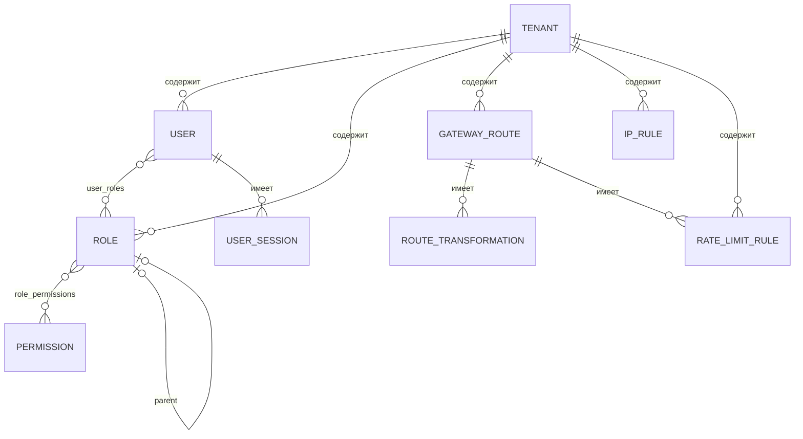

# GateKeeper — Архитектура

## 1. Обзор проекта

**GateKeeper** — OAuth2/OIDC Authorization Server + API Gateway с rate limiting, IP-фильтрацией и аналитикой трафика. Замена связки Keycloak + Kong в одном сервисе. Предназначен для IT-компаний (50-500 разработчиков), переходящих на микросервисную архитектуру.

### Функциональные требования

1. OAuth2 Authorization Server (authorization code flow, client credentials, refresh token)
2. Управление пользователями (CRUD, назначение ролей)
3. RBAC с иерархией ролей + granular permissions
4. Управление OAuth2-клиентами (регистрация, scopes, redirect URIs)
5. Multi-tenant (несколько организаций с изоляцией данных)
6. API Gateway с динамической маршрутизацией из БД
7. Rate limiting (Token Bucket через Redis)
8. IP Whitelist/Blacklist
9. Request/Response трансформация заголовков
10. Аналитика трафика (RPS, p50/p95/p99 latency)
11. Session management (просмотр и отзыв сессий)

### Нефункциональные требования

- **Производительность:** <50ms overhead на gateway proxy (p95)
- **Масштабируемость:** горизонтальное масштабирование через stateless JWT
- **Безопасность:** BCrypt для паролей, подписанные JWT (RS256), HTTPS-ready
- **Наблюдаемость:** structured JSON logging, Prometheus metrics, health checks
- **Тестируемость:** >80% покрытие, Testcontainers для интеграционных тестов

---

## 2. Стек технологий

| Слой | Технология | Обоснование |
|------|-----------|-------------|
| Язык | Java 21 (LTS) | Virtual Threads, pattern matching, records |
| Фреймворк | Spring Boot 3.3 | Стандарт enterprise Java |
| Сборка | Maven | Стандарт для enterprise |
| Auth Server | Spring Authorization Server | Официальный OAuth2/OIDC сервер от Spring |
| Безопасность | Spring Security 6 | Фильтры, RBAC, JWT валидация |
| Data Access | Spring Data JPA + Hibernate | ORM для PostgreSQL |
| БД | PostgreSQL 16 | Надежная RDBMS |
| Кеш / Rate Limit | Redis 7 | In-memory хранилище для bucket4j и кеширования |
| Rate Limiting | Bucket4j | Token Bucket алгоритм с Redis backend |
| Локальный кеш | Caffeine | Кеширование маршрутов и конфигов |
| Миграции | Liquibase | Версионирование схемы БД |
| API-документация | SpringDoc OpenAPI 2 | Swagger UI из коробки |
| Маппинг | MapStruct | Compile-time генерация маппинга DTO <-> Entity |
| Валидация | Jakarta Validation | Bean Validation для request DTO |
| HTTP-клиент | RestClient (Spring 6.1) | Проксирование запросов в gateway |
| Тесты | JUnit 5, Mockito, Testcontainers | Unit + интеграционные тесты |
| Контейнеризация | Docker, Docker Compose | Локальная разработка и деплой |
| CI/CD | GitHub Actions | Автоматическая сборка и тесты |
| Логирование | SLF4J + Logback | Structured JSON в проде |
| Метрики | Micrometer + Prometheus | RPS, latency, error rate |

### Архитектурное решение: единое приложение

Auth Server и Gateway работают в одном Spring Boot приложении (Servlet-стек). Gateway реализован как кастомный reverse proxy (RestClient + цепочка фильтров), а не через Spring Cloud Gateway (WebFlux). Причины:

1. Spring Authorization Server — Servlet-only, Spring Cloud Gateway — WebFlux-only. Несовместимы в одном процессе
2. Кастомный proxy демонстрирует паттерн Filter Chain и глубокое понимание HTTP
3. Для production развертывания gateway выносится в отдельный сервис, здесь — portfolio-демонстрация

---

## 3. Структура директорий

```
gatekeeper/
├── pom.xml
├── ARCHITECTURE.md
├── docker/
│   ├── Dockerfile
│   └── docker-compose.yml
├── .github/
│   └── workflows/
│       └── ci.yml
├── src/
│   ├── main/
│   │   ├── java/com/ashevtsov/gatekeeper/
│   │   │   ├── GatekeeperApplication.java
│   │   │   ├── config/
│   │   │   │   ├── AuthorizationServerConfig.java   — настройка Spring Auth Server
│   │   │   │   ├── SecurityConfig.java              — Spring Security фильтры
│   │   │   │   ├── RedisConfig.java                 — подключение Redis
│   │   │   │   ├── CacheConfig.java                 — Caffeine кеш
│   │   │   │   ├── RestClientConfig.java            — RestClient для proxy
│   │   │   │   └── OpenApiConfig.java               — Swagger UI
│   │   │   ├── user/
│   │   │   │   ├── User.java                        — entity
│   │   │   │   ├── UserRepository.java
│   │   │   │   ├── UserService.java
│   │   │   │   ├── UserController.java
│   │   │   │   ├── UserMapper.java                  — MapStruct
│   │   │   │   └── dto/
│   │   │   │       ├── CreateUserRequest.java
│   │   │   │       ├── UpdateUserRequest.java
│   │   │   │       └── UserResponse.java
│   │   │   ├── role/
│   │   │   │   ├── Role.java
│   │   │   │   ├── Permission.java
│   │   │   │   ├── RoleRepository.java
│   │   │   │   ├── PermissionRepository.java
│   │   │   │   ├── RoleService.java
│   │   │   │   ├── RoleController.java
│   │   │   │   ├── RoleMapper.java
│   │   │   │   └── dto/
│   │   │   │       ├── CreateRoleRequest.java
│   │   │   │       ├── UpdateRoleRequest.java
│   │   │   │       └── RoleResponse.java
│   │   │   ├── client/
│   │   │   │   ├── OAuthClientService.java
│   │   │   │   ├── OAuthClientController.java
│   │   │   │   ├── OAuthClientMapper.java
│   │   │   │   └── dto/
│   │   │   │       ├── RegisterClientRequest.java
│   │   │   │       ├── UpdateClientRequest.java
│   │   │   │       └── ClientResponse.java
│   │   │   ├── tenant/
│   │   │   │   ├── Tenant.java
│   │   │   │   ├── TenantRepository.java
│   │   │   │   ├── TenantService.java
│   │   │   │   ├── TenantController.java
│   │   │   │   ├── TenantMapper.java
│   │   │   │   └── dto/
│   │   │   │       ├── CreateTenantRequest.java
│   │   │   │       ├── UpdateTenantRequest.java
│   │   │   │       └── TenantResponse.java
│   │   │   ├── session/
│   │   │   │   ├── UserSession.java
│   │   │   │   ├── UserSessionRepository.java
│   │   │   │   ├── SessionService.java
│   │   │   │   └── SessionController.java
│   │   │   ├── gateway/
│   │   │   │   ├── GatewayRoute.java               — entity маршрута
│   │   │   │   ├── RouteTransformation.java         — entity трансформации
│   │   │   │   ├── GatewayRouteRepository.java
│   │   │   │   ├── RouteService.java
│   │   │   │   ├── RouteController.java             — CRUD маршрутов
│   │   │   │   ├── RouteMapper.java
│   │   │   │   ├── RouteResolver.java               — резолв маршрута по path
│   │   │   │   ├── ProxyController.java             — catch-all reverse proxy
│   │   │   │   ├── ProxyService.java                — выполнение proxy-вызова
│   │   │   │   ├── filter/
│   │   │   │   │   ├── GatewayFilter.java           — интерфейс фильтра
│   │   │   │   │   ├── GatewayFilterChain.java      — цепочка фильтров
│   │   │   │   │   ├── GatewayContext.java           — контекст запроса
│   │   │   │   │   ├── IpFilter.java                — IP whitelist/blacklist
│   │   │   │   │   ├── RateLimitFilter.java         — Token Bucket
│   │   │   │   │   ├── AuthFilter.java              — JWT валидация
│   │   │   │   │   ├── TransformationFilter.java    — заголовки
│   │   │   │   │   └── TrafficLoggingFilter.java    — логирование
│   │   │   │   └── dto/
│   │   │   │       ├── CreateRouteRequest.java
│   │   │   │       ├── UpdateRouteRequest.java
│   │   │   │       └── RouteResponse.java
│   │   │   ├── ratelimit/
│   │   │   │   ├── RateLimitRule.java               — entity
│   │   │   │   ├── RateLimitRepository.java
│   │   │   │   ├── RateLimitService.java
│   │   │   │   ├── RateLimitController.java
│   │   │   │   └── dto/
│   │   │   │       ├── CreateRateLimitRequest.java
│   │   │   │       └── RateLimitResponse.java
│   │   │   ├── ipfilter/
│   │   │   │   ├── IpRule.java
│   │   │   │   ├── IpRuleRepository.java
│   │   │   │   ├── IpFilterService.java
│   │   │   │   ├── IpRuleController.java
│   │   │   │   └── dto/
│   │   │   │       ├── CreateIpRuleRequest.java
│   │   │   │       └── IpRuleResponse.java
│   │   │   ├── analytics/
│   │   │   │   ├── TrafficLog.java
│   │   │   │   ├── TrafficLogRepository.java
│   │   │   │   ├── AnalyticsService.java
│   │   │   │   ├── AnalyticsController.java
│   │   │   │   └── dto/
│   │   │   │       ├── TrafficOverview.java
│   │   │   │       └── RouteStats.java
│   │   │   ├── audit/
│   │   │   │   ├── AuditLog.java
│   │   │   │   ├── AuditLogRepository.java
│   │   │   │   └── AuditService.java
│   │   │   ├── security/
│   │   │   │   ├── CustomUserDetailsService.java
│   │   │   │   ├── JwtTokenCustomizer.java          — custom claims в JWT
│   │   │   │   └── TenantContext.java               — ThreadLocal текущего тенанта
│   │   │   └── common/
│   │   │       ├── dto/
│   │   │       │   ├── PageResponse.java
│   │   │       │   └── ErrorResponse.java
│   │   │       └── exception/
│   │   │           ├── GatekeeperException.java
│   │   │           ├── NotFoundException.java
│   │   │           ├── ConflictException.java
│   │   │           └── GlobalExceptionHandler.java
│   │   └── resources/
│   │       ├── application.yml
│   │       ├── application-dev.yml
│   │       ├── application-prod.yml
│   │       ├── logback-spring.xml
│   │       └── db/changelog/
│   │           ├── db.changelog-master.xml
│   │           ├── 001-create-tenants.xml
│   │           ├── 002-create-users-roles.xml
│   │           ├── 003-create-oauth2-tables.xml
│   │           ├── 004-create-gateway-routes.xml
│   │           ├── 005-create-ip-rules.xml
│   │           ├── 006-create-rate-limits.xml
│   │           ├── 007-create-traffic-logs.xml
│   │           ├── 008-create-audit-logs.xml
│   │           └── 009-create-sessions.xml
│   └── test/
│       └── java/com/ashevtsov/gatekeeper/
│           ├── user/
│           │   ├── UserServiceTest.java
│           │   └── UserControllerIT.java
│           ├── role/
│           │   ├── RoleServiceTest.java
│           │   └── RoleControllerIT.java
│           ├── client/
│           │   └── OAuthClientControllerIT.java
│           ├── tenant/
│           │   └── TenantControllerIT.java
│           ├── gateway/
│           │   ├── RouteResolverTest.java
│           │   ├── ProxyServiceTest.java
│           │   ├── ProxyControllerIT.java
│           │   └── filter/
│           │       ├── IpFilterTest.java
│           │       ├── RateLimitFilterTest.java
│           │       └── GatewayFilterChainTest.java
│           ├── analytics/
│           │   └── AnalyticsServiceTest.java
│           ├── security/
│           │   ├── OAuth2AuthorizationCodeIT.java
│           │   ├── OAuth2ClientCredentialsIT.java
│           │   └── RbacIT.java
│           └── AbstractIntegrationTest.java         — база с Testcontainers
```

---

## 4. Сущности (Domain Model)

### 4.1 Tenant (тенант / организация)

```
Tenant
├── id: UUID (PK, gen=UUID)
├── name: VARCHAR(255) NOT NULL
├── slug: VARCHAR(100) UNIQUE NOT NULL — для URL-ов и API-ключей
├── apiKey: VARCHAR(255) UNIQUE NOT NULL — ключ для доступа к gateway
├── enabled: BOOLEAN DEFAULT true
├── maxRequestsPerSecond: INT DEFAULT 100 — глобальный лимит RPS
├── createdAt: TIMESTAMP NOT NULL
└── updatedAt: TIMESTAMP NOT NULL
```

Связи: Tenant 1:N User, Tenant 1:N GatewayRoute, Tenant 1:N IpRule, Tenant 1:N RateLimitRule

### 4.2 User (пользователь)

```
User
├── id: UUID (PK, gen=UUID)
├── username: VARCHAR(50) UNIQUE NOT NULL
├── email: VARCHAR(255) UNIQUE NOT NULL
├── passwordHash: VARCHAR(255) NOT NULL — BCrypt
├── firstName: VARCHAR(100)
├── lastName: VARCHAR(100)
├── enabled: BOOLEAN DEFAULT true
├── tenantId: UUID (FK -> Tenant) NOT NULL
├── createdAt: TIMESTAMP NOT NULL
└── updatedAt: TIMESTAMP NOT NULL
```

Связи: User N:1 Tenant, User N:M Role (через user_roles)

### 4.3 Role (роль)

```
Role
├── id: UUID (PK, gen=UUID)
├── name: VARCHAR(100) NOT NULL
├── description: VARCHAR(500)
├── parentId: UUID (FK -> Role, nullable) — иерархия ролей
├── tenantId: UUID (FK -> Tenant) NOT NULL
├── createdAt: TIMESTAMP NOT NULL
└── UNIQUE(name, tenantId)
```

Связи: Role N:1 Role (self, parent), Role N:M User (через user_roles), Role N:M Permission (через role_permissions)

### 4.4 Permission (разрешение)

```
Permission
├── id: UUID (PK, gen=UUID)
├── name: VARCHAR(100) NOT NULL — напр. "users:read"
├── resource: VARCHAR(100) NOT NULL — напр. "users"
├── action: VARCHAR(50) NOT NULL — READ, WRITE, DELETE, ADMIN
├── description: VARCHAR(500)
└── UNIQUE(resource, action)
```

Связи: Permission N:M Role (через role_permissions)

### 4.5 UserSession (сессия)

```
UserSession
├── id: UUID (PK, gen=UUID)
├── userId: UUID (FK -> User) NOT NULL
├── accessTokenHash: VARCHAR(255) NOT NULL
├── refreshTokenHash: VARCHAR(255)
├── ipAddress: VARCHAR(45)
├── userAgent: VARCHAR(500)
├── expiresAt: TIMESTAMP NOT NULL
├── revoked: BOOLEAN DEFAULT false
└── createdAt: TIMESTAMP NOT NULL
```

Связи: UserSession N:1 User

### 4.6 GatewayRoute (маршрут)

```
GatewayRoute
├── id: UUID (PK, gen=UUID)
├── tenantId: UUID (FK -> Tenant) NOT NULL
├── name: VARCHAR(255) NOT NULL
├── predicatePath: VARCHAR(500) NOT NULL — напр. "/users-service/**"
├── targetUrl: VARCHAR(500) NOT NULL — напр. "http://user-service:8081"
├── methods: VARCHAR(100) — "GET,POST" или null (все методы)
├── stripPrefix: INT DEFAULT 1 — сколько сегментов пути убрать
├── orderPriority: INT DEFAULT 0 — приоритет (меньше = выше)
├── enabled: BOOLEAN DEFAULT true
├── requireAuth: BOOLEAN DEFAULT true
├── requiredScopes: VARCHAR(500) — "read,write" или null
├── createdAt: TIMESTAMP NOT NULL
└── updatedAt: TIMESTAMP NOT NULL
```

Связи: GatewayRoute N:1 Tenant, GatewayRoute 1:N RouteTransformation, GatewayRoute 1:N RateLimitRule

### 4.7 RouteTransformation (трансформация)

```
RouteTransformation
├── id: UUID (PK, gen=UUID)
├── routeId: UUID (FK -> GatewayRoute) NOT NULL
├── phase: VARCHAR(10) NOT NULL — REQUEST, RESPONSE
├── operation: VARCHAR(10) NOT NULL — ADD, REMOVE, SET
├── headerName: VARCHAR(255) NOT NULL
├── headerValue: VARCHAR(500) — null для REMOVE
└── createdAt: TIMESTAMP NOT NULL
```

Связи: RouteTransformation N:1 GatewayRoute

### 4.8 IpRule (IP-правило)

```
IpRule
├── id: UUID (PK, gen=UUID)
├── tenantId: UUID (FK -> Tenant) NOT NULL
├── ipAddress: VARCHAR(45) NOT NULL — поддержка CIDR (192.168.1.0/24)
├── ruleType: VARCHAR(10) NOT NULL — WHITELIST, BLACKLIST
├── description: VARCHAR(500)
├── createdAt: TIMESTAMP NOT NULL
└── UNIQUE(tenantId, ipAddress)
```

Связи: IpRule N:1 Tenant

### 4.9 RateLimitRule (правило лимитирования)

```
RateLimitRule
├── id: UUID (PK, gen=UUID)
├── tenantId: UUID (FK -> Tenant) NOT NULL
├── routeId: UUID (FK -> GatewayRoute, nullable) — null = глобальный лимит тенанта
├── requestsPerSecond: INT NOT NULL
├── burstCapacity: INT NOT NULL — максимум запросов в "всплеске"
├── createdAt: TIMESTAMP NOT NULL
└── updatedAt: TIMESTAMP NOT NULL
```

Связи: RateLimitRule N:1 Tenant, RateLimitRule N:1 GatewayRoute (optional)

### 4.10 TrafficLog (лог трафика)

```
TrafficLog
├── id: BIGSERIAL (PK)
├── tenantId: UUID NOT NULL
├── routeId: UUID — null если маршрут не найден
├── method: VARCHAR(10) NOT NULL
├── path: VARCHAR(500) NOT NULL
├── statusCode: INT NOT NULL
├── latencyMs: BIGINT NOT NULL
├── clientIp: VARCHAR(45)
├── requestSizeBytes: BIGINT
├── responseSizeBytes: BIGINT
└── createdAt: TIMESTAMP NOT NULL DEFAULT now()
```

Индексы: (tenant_id, created_at), (route_id, created_at)

### 4.11 AuditLog (аудит)

```
AuditLog
├── id: BIGSERIAL (PK)
├── userId: UUID — кто выполнил действие
├── tenantId: UUID
├── action: VARCHAR(50) NOT NULL — CREATE_USER, UPDATE_ROUTE, DELETE_IP_RULE...
├── entityType: VARCHAR(50) NOT NULL — USER, ROLE, ROUTE, IP_RULE...
├── entityId: VARCHAR(255) — UUID измененной сущности
├── details: JSONB — снимок изменений
└── createdAt: TIMESTAMP NOT NULL DEFAULT now()
```

### ER-диаграмма



---

## 5. API Endpoints

### 5.1 OAuth2 (Spring Authorization Server — автоматически)

| Метод | URL | Описание | Auth |
|-------|-----|----------|------|
| POST | `/oauth2/token` | Получение access/refresh токенов | Client credentials |
| GET | `/oauth2/authorize` | Authorization Code Flow (начало) | Браузер |
| POST | `/oauth2/revoke` | Отзыв токена | Bearer |
| POST | `/oauth2/introspect` | Интроспекция токена | Client credentials |
| GET | `/oauth2/jwks` | JWK Set (публичные ключи) | Public |
| GET | `/.well-known/openid-configuration` | OIDC Discovery | Public |

### 5.2 Users — `/api/v1/users`

| Метод | URL | Описание | Auth |
|-------|-----|----------|------|
| POST | `/api/v1/users` | Создать пользователя | ADMIN |
| GET | `/api/v1/users` | Список пользователей (пагинация, поиск) | ADMIN |
| GET | `/api/v1/users/{id}` | Получить пользователя | ADMIN |
| PUT | `/api/v1/users/{id}` | Обновить пользователя | ADMIN |
| DELETE | `/api/v1/users/{id}` | Деактивировать пользователя | ADMIN |

**POST /api/v1/users — Request:**
```json
{
  "username": "john.doe",
  "email": "john@example.com",
  "password": "SecurePass123!",
  "firstName": "John",
  "lastName": "Doe",
  "roleIds": ["uuid-role-1", "uuid-role-2"]
}
```

**Response (201):**
```json
{
  "id": "uuid",
  "username": "john.doe",
  "email": "john@example.com",
  "firstName": "John",
  "lastName": "Doe",
  "enabled": true,
  "roles": [{"id": "uuid", "name": "OPERATOR"}],
  "tenantId": "uuid",
  "createdAt": "2026-08-08T12:00:00Z"
}
```

**GET /api/v1/users — Response (200):**
```json
{
  "content": [{ "...user..." }],
  "page": 0,
  "size": 20,
  "totalElements": 150,
  "totalPages": 8
}
```

Query params: `page`, `size`, `search` (по username/email), `enabled`

### 5.3 Roles — `/api/v1/roles`

| Метод | URL | Описание | Auth |
|-------|-----|----------|------|
| POST | `/api/v1/roles` | Создать роль | ADMIN |
| GET | `/api/v1/roles` | Список ролей | ADMIN |
| GET | `/api/v1/roles/{id}` | Роль с permissions | ADMIN |
| PUT | `/api/v1/roles/{id}` | Обновить роль (включая permissions) | ADMIN |
| DELETE | `/api/v1/roles/{id}` | Удалить роль | ADMIN |

**POST /api/v1/roles — Request:**
```json
{
  "name": "OPERATOR",
  "description": "Оператор службы поддержки",
  "parentId": "uuid-parent-role",
  "permissionIds": ["uuid-perm-1", "uuid-perm-2"]
}
```

**Response (201):**
```json
{
  "id": "uuid",
  "name": "OPERATOR",
  "description": "Оператор службы поддержки",
  "parentId": "uuid-parent-role",
  "permissions": [
    {"id": "uuid", "name": "users:read", "resource": "users", "action": "READ"}
  ],
  "createdAt": "2026-08-08T12:00:00Z"
}
```

### 5.4 OAuth2 Clients — `/api/v1/clients`

| Метод | URL | Описание | Auth |
|-------|-----|----------|------|
| POST | `/api/v1/clients` | Зарегистрировать клиент | ADMIN |
| GET | `/api/v1/clients` | Список клиентов | ADMIN |
| GET | `/api/v1/clients/{id}` | Получить клиент | ADMIN |
| PUT | `/api/v1/clients/{id}` | Обновить клиент | ADMIN |
| DELETE | `/api/v1/clients/{id}` | Деактивировать клиент | ADMIN |

**POST /api/v1/clients — Request:**
```json
{
  "clientId": "my-web-app",
  "clientName": "My Web Application",
  "grantTypes": ["authorization_code", "refresh_token"],
  "redirectUris": ["http://localhost:3000/callback"],
  "scopes": ["openid", "profile", "read", "write"],
  "tokenTtlSeconds": 3600,
  "refreshTokenTtlSeconds": 86400
}
```

**Response (201):**
```json
{
  "id": "uuid",
  "clientId": "my-web-app",
  "clientSecret": "generated-secret-shown-once",
  "clientName": "My Web Application",
  "grantTypes": ["authorization_code", "refresh_token"],
  "redirectUris": ["http://localhost:3000/callback"],
  "scopes": ["openid", "profile", "read", "write"],
  "tokenTtlSeconds": 3600,
  "enabled": true,
  "createdAt": "2026-08-08T12:00:00Z"
}
```

### 5.5 Tenants — `/api/v1/tenants`

| Метод | URL | Описание | Auth |
|-------|-----|----------|------|
| POST | `/api/v1/tenants` | Создать тенант | SUPER_ADMIN |
| GET | `/api/v1/tenants` | Список тенантов | SUPER_ADMIN |
| GET | `/api/v1/tenants/{id}` | Получить тенант | ADMIN |
| PUT | `/api/v1/tenants/{id}` | Обновить тенант | ADMIN |

**POST /api/v1/tenants — Request:**
```json
{
  "name": "Acme Corp",
  "slug": "acme",
  "maxRequestsPerSecond": 200
}
```

**Response (201):**
```json
{
  "id": "uuid",
  "name": "Acme Corp",
  "slug": "acme",
  "apiKey": "gk_live_abc123...",
  "enabled": true,
  "maxRequestsPerSecond": 200,
  "createdAt": "2026-08-08T12:00:00Z"
}
```

### 5.6 Sessions — `/api/v1/sessions`

| Метод | URL | Описание | Auth |
|-------|-----|----------|------|
| GET | `/api/v1/sessions` | Активные сессии текущего пользователя | Bearer |
| DELETE | `/api/v1/sessions/{id}` | Отозвать сессию | Bearer |

### 5.7 Gateway Routes — `/api/v1/routes`

| Метод | URL | Описание | Auth |
|-------|-----|----------|------|
| POST | `/api/v1/routes` | Создать маршрут | ADMIN |
| GET | `/api/v1/routes` | Список маршрутов тенанта | ADMIN |
| GET | `/api/v1/routes/{id}` | Получить маршрут с трансформациями | ADMIN |
| PUT | `/api/v1/routes/{id}` | Обновить маршрут | ADMIN |
| DELETE | `/api/v1/routes/{id}` | Удалить маршрут | ADMIN |

**POST /api/v1/routes — Request:**
```json
{
  "name": "User Service",
  "predicatePath": "/users-service/**",
  "targetUrl": "http://user-service:8081",
  "methods": "GET,POST,PUT,DELETE",
  "stripPrefix": 1,
  "orderPriority": 10,
  "requireAuth": true,
  "requiredScopes": "read,write",
  "transformations": [
    {
      "phase": "REQUEST",
      "operation": "ADD",
      "headerName": "X-Tenant-Id",
      "headerValue": "{{tenantId}}"
    }
  ]
}
```

### 5.8 IP Rules — `/api/v1/ip-rules`

| Метод | URL | Описание | Auth |
|-------|-----|----------|------|
| POST | `/api/v1/ip-rules` | Добавить IP-правило | ADMIN |
| GET | `/api/v1/ip-rules` | Список IP-правил тенанта | ADMIN |
| DELETE | `/api/v1/ip-rules/{id}` | Удалить IP-правило | ADMIN |

**POST /api/v1/ip-rules — Request:**
```json
{
  "ipAddress": "192.168.1.0/24",
  "ruleType": "WHITELIST",
  "description": "Офисная сеть"
}
```

### 5.9 Rate Limits — `/api/v1/rate-limits`

| Метод | URL | Описание | Auth |
|-------|-----|----------|------|
| POST | `/api/v1/rate-limits` | Создать правило лимитирования | ADMIN |
| GET | `/api/v1/rate-limits` | Список правил тенанта | ADMIN |
| DELETE | `/api/v1/rate-limits/{id}` | Удалить правило | ADMIN |

**POST /api/v1/rate-limits — Request:**
```json
{
  "routeId": "uuid-route",
  "requestsPerSecond": 50,
  "burstCapacity": 100
}
```

### 5.10 Analytics — `/api/v1/analytics`

| Метод | URL | Описание | Auth |
|-------|-----|----------|------|
| GET | `/api/v1/analytics/overview` | Общая статистика трафика | ADMIN |
| GET | `/api/v1/analytics/routes/{id}` | Статистика по маршруту | ADMIN |

**GET /api/v1/analytics/overview — Response (200):**
```json
{
  "totalRequests": 125430,
  "periodStart": "2026-08-08T00:00:00Z",
  "periodEnd": "2026-08-08T23:59:59Z",
  "rps": 45.2,
  "latency": {
    "p50": 12,
    "p95": 45,
    "p99": 120
  },
  "statusCodeBreakdown": {
    "2xx": 120000,
    "4xx": 5000,
    "5xx": 430
  },
  "topRoutes": [
    {"routeId": "uuid", "name": "User Service", "requests": 50000}
  ]
}
```

Query params: `from`, `to` (период), `routeId` (фильтр)

### Итого эндпоинтов

| Группа | Кол-во |
|--------|--------|
| OAuth2 (фреймворк) | 6 |
| Users | 5 |
| Roles | 5 |
| Clients | 5 |
| Tenants | 4 |
| Sessions | 2 |
| Routes | 5 |
| IP Rules | 3 |
| Rate Limits | 3 |
| Analytics | 2 |
| **Итого** | **40 (6 фреймворк + 34 кастомных)** |

---

## 6. Схема базы данных

### Таблицы

```sql
-- тенанты (организации)
create table tenants (
    id            uuid primary key default gen_random_uuid(),
    name          varchar(255) not null,
    slug          varchar(100) not null unique,
    api_key       varchar(255) not null unique,
    enabled       boolean not null default true,
    max_rps       int not null default 100,
    created_at    timestamp not null default now(),
    updated_at    timestamp not null default now()
);

-- пользователи
create table users (
    id            uuid primary key default gen_random_uuid(),
    username      varchar(50) not null unique,
    email         varchar(255) not null unique,
    password_hash varchar(255) not null,
    first_name    varchar(100),
    last_name     varchar(100),
    enabled       boolean not null default true,
    tenant_id     uuid not null references tenants(id),
    created_at    timestamp not null default now(),
    updated_at    timestamp not null default now()
);
create index idx_users_tenant on users(tenant_id);
create index idx_users_email on users(email);

-- роли
create table roles (
    id          uuid primary key default gen_random_uuid(),
    name        varchar(100) not null,
    description varchar(500),
    parent_id   uuid references roles(id),
    tenant_id   uuid not null references tenants(id),
    created_at  timestamp not null default now(),
    unique(name, tenant_id)
);
create index idx_roles_tenant on roles(tenant_id);

-- разрешения
create table permissions (
    id          uuid primary key default gen_random_uuid(),
    name        varchar(100) not null unique,
    resource    varchar(100) not null,
    action      varchar(50) not null,
    description varchar(500),
    unique(resource, action)
);

-- связь пользователи <-> роли
create table user_roles (
    user_id uuid not null references users(id) on delete cascade,
    role_id uuid not null references roles(id) on delete cascade,
    primary key (user_id, role_id)
);

-- связь роли <-> разрешения
create table role_permissions (
    role_id       uuid not null references roles(id) on delete cascade,
    permission_id uuid not null references permissions(id) on delete cascade,
    primary key (role_id, permission_id)
);

-- сессии пользователей
create table user_sessions (
    id                 uuid primary key default gen_random_uuid(),
    user_id            uuid not null references users(id) on delete cascade,
    access_token_hash  varchar(255) not null,
    refresh_token_hash varchar(255),
    ip_address         varchar(45),
    user_agent         varchar(500),
    expires_at         timestamp not null,
    revoked            boolean not null default false,
    created_at         timestamp not null default now()
);
create index idx_sessions_user on user_sessions(user_id);
create index idx_sessions_expires on user_sessions(expires_at) where revoked = false;

-- маршруты gateway
create table gateway_routes (
    id              uuid primary key default gen_random_uuid(),
    tenant_id       uuid not null references tenants(id),
    name            varchar(255) not null,
    predicate_path  varchar(500) not null,
    target_url      varchar(500) not null,
    methods         varchar(100),
    strip_prefix    int not null default 1,
    order_priority  int not null default 0,
    enabled         boolean not null default true,
    require_auth    boolean not null default true,
    required_scopes varchar(500),
    created_at      timestamp not null default now(),
    updated_at      timestamp not null default now()
);
create index idx_routes_tenant on gateway_routes(tenant_id);

-- трансформации заголовков маршрутов
create table route_transformations (
    id           uuid primary key default gen_random_uuid(),
    route_id     uuid not null references gateway_routes(id) on delete cascade,
    phase        varchar(10) not null,
    operation    varchar(10) not null,
    header_name  varchar(255) not null,
    header_value varchar(500),
    created_at   timestamp not null default now()
);

-- IP-правила
create table ip_rules (
    id          uuid primary key default gen_random_uuid(),
    tenant_id   uuid not null references tenants(id),
    ip_address  varchar(45) not null,
    rule_type   varchar(10) not null,
    description varchar(500),
    created_at  timestamp not null default now(),
    unique(tenant_id, ip_address)
);

-- правила rate limiting
create table rate_limit_rules (
    id                  uuid primary key default gen_random_uuid(),
    tenant_id           uuid not null references tenants(id),
    route_id            uuid references gateway_routes(id) on delete cascade,
    requests_per_second int not null,
    burst_capacity      int not null,
    created_at          timestamp not null default now(),
    updated_at          timestamp not null default now()
);

-- логи трафика (append-only, партиционировать по месяцам в проде)
create table traffic_logs (
    id                  bigserial primary key,
    tenant_id           uuid not null,
    route_id            uuid,
    method              varchar(10) not null,
    path                varchar(500) not null,
    status_code         int not null,
    latency_ms          bigint not null,
    client_ip           varchar(45),
    request_size_bytes  bigint,
    response_size_bytes bigint,
    created_at          timestamp not null default now()
);
create index idx_traffic_tenant_time on traffic_logs(tenant_id, created_at);
create index idx_traffic_route_time on traffic_logs(route_id, created_at);

-- аудит-лог (append-only)
create table audit_logs (
    id          bigserial primary key,
    user_id     uuid,
    tenant_id   uuid,
    action      varchar(50) not null,
    entity_type varchar(50) not null,
    entity_id   varchar(255),
    details     jsonb,
    created_at  timestamp not null default now()
);
create index idx_audit_tenant_time on audit_logs(tenant_id, created_at);
```

Плюс 3 таблицы Spring Authorization Server (создаются автоматически через Liquibase):
- `oauth2_registered_client`
- `oauth2_authorization`
- `oauth2_authorization_consent`

### Миграции Liquibase

Файл `db.changelog-master.xml` подключает changesets в порядке:
1. `001-create-tenants.xml` — tenants
2. `002-create-users-roles.xml` — users, roles, permissions, user_roles, role_permissions
3. `003-create-oauth2-tables.xml` — Spring Auth Server таблицы
4. `004-create-gateway-routes.xml` — gateway_routes, route_transformations
5. `005-create-ip-rules.xml` — ip_rules
6. `006-create-rate-limits.xml` — rate_limit_rules
7. `007-create-traffic-logs.xml` — traffic_logs
8. `008-create-audit-logs.xml` — audit_logs
9. `009-create-sessions.xml` — user_sessions
10. `010-seed-data.xml` — начальные данные (SUPER_ADMIN, базовые permissions, дефолтный тенант)

---

## 7. Docker

### Контейнеры

| Сервис | Образ | Порт | Назначение |
|--------|-------|------|------------|
| gatekeeper | openjdk:21-slim (custom build) | 8080 | Основное приложение |
| postgres | postgres:16-alpine | 5432 | БД |
| redis | redis:7-alpine | 6379 | Кеш + rate limiting |
| echo-service | hashicorp/http-echo | 9090 | Демо-сервис для тестирования proxy |

### docker-compose.yml (схема)

```yaml
services:
  gatekeeper:
    build:
      context: .
      dockerfile: docker/Dockerfile
    ports:
      - "8080:8080"
    environment:
      SPRING_DATASOURCE_URL: jdbc:postgresql://postgres:5432/gatekeeper
      SPRING_DATASOURCE_USERNAME: gatekeeper
      SPRING_DATASOURCE_PASSWORD: gatekeeper
      SPRING_DATA_REDIS_HOST: redis
      SPRING_DATA_REDIS_PORT: 6379
    depends_on:
      postgres:
        condition: service_healthy
      redis:
        condition: service_healthy

  postgres:
    image: postgres:16-alpine
    ports:
      - "5432:5432"
    environment:
      POSTGRES_DB: gatekeeper
      POSTGRES_USER: gatekeeper
      POSTGRES_PASSWORD: gatekeeper
    volumes:
      - pgdata:/var/lib/postgresql/data
    healthcheck:
      test: ["CMD-SHELL", "pg_isready -U gatekeeper"]
      interval: 5s
      timeout: 3s
      retries: 5

  redis:
    image: redis:7-alpine
    ports:
      - "6379:6379"
    healthcheck:
      test: ["CMD", "redis-cli", "ping"]
      interval: 5s
      timeout: 3s
      retries: 5

  echo-service:
    image: hashicorp/http-echo
    command: ["-text", "{\"status\":\"ok\",\"service\":\"echo\"}"]
    ports:
      - "9090:5678"

volumes:
  pgdata:
```

### Dockerfile (multi-stage)

```dockerfile
FROM maven:3.9-eclipse-temurin-21-alpine AS build
WORKDIR /app
COPY pom.xml .
RUN mvn dependency:go-offline -B
COPY src ./src
RUN mvn package -DskipTests -B

FROM eclipse-temurin:21-jre-alpine
WORKDIR /app
COPY --from=build /app/target/gatekeeper-*.jar app.jar
EXPOSE 8080
ENTRYPOINT ["java", "-jar", "app.jar"]
```

---

## 8. Паттерны и принципы

### 8.1 Архитектурные паттерны

- **Domain-Driven Packaging** — пакеты по доменам (user, role, gateway), а не по слоям (controller, service, repository)
- **Filter Chain** — кастомная цепочка фильтров для gateway (IpFilter → RateLimitFilter → AuthFilter → TransformationFilter → TrafficLoggingFilter)
- **Token Bucket** — алгоритм rate limiting через Bucket4j + Redis
- **Reverse Proxy** — проксирование HTTP-запросов к upstream-сервисам через RestClient
- **RBAC с иерархией** — роли наследуют permissions от parent-ролей
- **Multi-tenant** — изоляция данных через tenant_id + TenantContext (ThreadLocal)

### 8.2 Поток запроса через Gateway

```
Клиент → [ProxyController] → [GatewayFilterChain]
  1. IpFilter         — проверка IP whitelist/blacklist
  2. RateLimitFilter   — Token Bucket (Bucket4j + Redis)
  3. AuthFilter        — JWT валидация + scope проверка
  4. TransformationFilter — добавление/удаление заголовков
  → ProxyService      — RestClient вызов к upstream
  5. TrafficLoggingFilter — запись TrafficLog (async)
→ Response клиенту
```

### 8.3 Обработка ошибок

Единый формат ошибок через `GlobalExceptionHandler` (`@RestControllerAdvice`):

```json
{
  "timestamp": "2026-08-08T12:00:00Z",
  "status": 404,
  "error": "Not Found",
  "message": "User with id 'uuid' not found",
  "path": "/api/v1/users/uuid"
}
```

Маппинг исключений:
- `NotFoundException` → 404
- `ConflictException` → 409
- `MethodArgumentNotValidException` → 400 (с деталями по полям)
- `AccessDeniedException` → 403
- `AuthenticationException` → 401
- Все остальное → 500

### 8.4 Логирование

- **Формат:** structured JSON в production (через Logback encoder)
- **MDC:** requestId, tenantId, userId — добавляются через servlet filter
- **Уровни:** ERROR — ошибки, WARN — подозрительная активность (rate limit, IP block), INFO — бизнес-события, DEBUG — детали запросов

### 8.5 Валидация

- Jakarta Validation (`@NotBlank`, `@Email`, `@Size`, `@Pattern`) на request DTO
- Custom validators для бизнес-правил (уникальность username, валидность CIDR)
- Валидация происходит на уровне контроллера (`@Valid`)

### 8.6 Безопасность

- **Пароли:** BCrypt (strength=12)
- **JWT:** RS256 (RSA подпись), access token TTL=1h, refresh token TTL=24h
- **Custom claims в JWT:** tenantId, roles, permissions — через `JwtTokenCustomizer`
- **CORS:** настраивается через `SecurityConfig`
- **CSRF:** отключен (API-only, stateless JWT)
- **Множественные SecurityFilterChain:** отдельные цепочки для OAuth2 endpoints, admin API, gateway proxy

### 8.7 Кеширование

- **Caffeine (локальный):** маршруты (TTL=5 мин), IP-правила (TTL=5 мин), rate limit конфиги (TTL=5 мин)
- **Redis:** состояние Token Bucket (per tenant/route), refresh token blacklist
- **Инвалидация:** при CRUD-операциях через `@CacheEvict`

### 8.8 Метрики (Prometheus)

- `gatekeeper_proxy_requests_total` — counter по route, status, method
- `gatekeeper_proxy_latency_seconds` — histogram по route
- `gatekeeper_rate_limit_rejected_total` — counter отклоненных запросов
- `gatekeeper_ip_blocked_total` — counter заблокированных IP
- `gatekeeper_active_sessions` — gauge активных сессий
- Стандартные JVM/Spring метрики через Micrometer Actuator

### 8.9 Тестирование

| Тип | Кол-во | Инструменты | Что покрывает |
|-----|--------|-------------|---------------|
| Unit | ~30 | JUnit 5, Mockito | Сервисы, фильтры, маппинг |
| Integration | ~30 | Testcontainers (PostgreSQL, Redis) | API, репозитории, полный flow |
| Security | ~15 | Spring Security Test | OAuth2 flows, RBAC, token validation |
| Gateway | ~15 | WireMock, Testcontainers | Proxy, rate limiting, IP filtering |
| **Итого** | **~90** | | |

Базовый класс `AbstractIntegrationTest` поднимает Testcontainers (PostgreSQL + Redis) один раз для всех IT-тестов.
