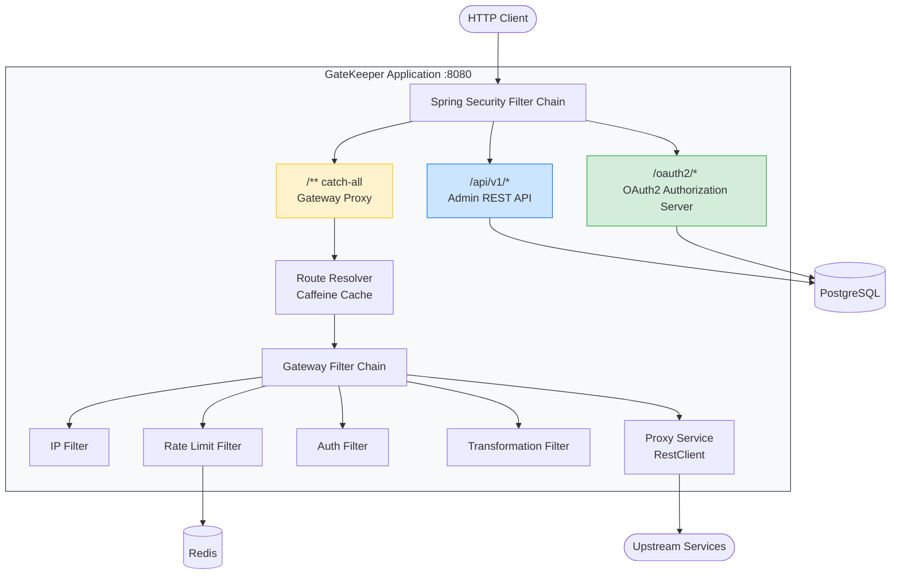

# GateKeeper

**Enterprise API Gateway и Identity Provider**

[](https://openjdk.org/)
[](https://spring.io/projects/spring-boot)
[](LICENSE)

GateKeeper — централизованный сервис аутентификации, авторизации и управления API-трафиком для микросервисных архитектур. Объединяет функциональность Identity Provider (аналог Keycloak) и API Gateway (аналог Kong) в едином продукте. Демонстрирует глубокое понимание Spring Security, паттерна API Gateway и интеграции с Redis.

---

## Архитектура



---

## Технологии

| Слой | Технология |
|------|-----------|
| Язык | Java 21 |
| Фреймворк | Spring Boot 3.3.2, Spring Security, Spring Authorization Server |
| Отказоустойчивость | Resilience4j (Circuit Breaker) |
| База данных | PostgreSQL 16 |
| Кеш | Redis 7 (rate limiting), Caffeine (кеш маршрутов и конфигураций) |
| Миграции | Liquibase |
| Маппинг | MapStruct |
| Документация API | SpringDoc OpenAPI (Swagger UI) |
| Тестирование | JUnit 5, Testcontainers, WireMock, Mockito |
| Наблюдаемость | Micrometer + Prometheus, структурированные JSON-логи (Logback) |
| Контейнеризация | Docker, Docker Compose |

---

## Ключевые возможности

- **OAuth2 / OIDC Authorization Server** — Authorization Code, Client Credentials, Refresh Token с JWKS и Discovery-эндпоинтами
- **RBAC с иерархией ролей** — SUPER_ADMIN > ADMIN > OPERATOR > VIEWER с гранулярными правами (`users:read`, `routes:write`)
- **Мультитенантная изоляция** — разделение данных по тенантам, идентификация по API-ключу, лимиты RPS на тенант
- **Динамический API Gateway** — маршрутизация из БД, strip-prefix, фильтрация методов, приоритетный порядок
- **Rate Limiting** — алгоритм Token Bucket через Redis с заголовками `X-RateLimit-Remaining` и `Retry-After`
- **IP-фильтрация** — whitelist/blacklist с поддержкой CIDR по тенантам
- **Circuit Breaker** — отказоустойчивость upstream-сервисов на базе Resilience4j
- **Трансформация запросов/ответов** — манипуляция заголовками на уровне маршрутов (добавление, удаление, замена)
- **Аналитика трафика** — RPS, перцентили задержки (p50/p95/p99), разбивка по кодам ответа
- **Аудит-логирование** — append-only журнал административных действий с JSONB-трекингом изменений
- **Управление сессиями** — просмотр и отзыв активных пользовательских сессий
- **Prometheus-метрики** — пропускная способность шлюза, гистограммы задержки, отказы rate limiter, блокировки по IP

---

## API Endpoints

| Группа | Префикс | Эндпоинты | Аутентификация |
|--------|---------|-----------|----------------|
| OAuth2 Protocol | `/oauth2/*` | `POST /token`, `POST /authorize`, `POST /revoke`, `POST /introspect` | OAuth2 standard |
| OIDC Discovery | `/.well-known/*` | OpenID Configuration, JWKS | Публичный |
| Пользователи | `/api/v1/users` | CRUD + поиск, пагинация | ADMIN+ |
| Роли | `/api/v1/roles` | CRUD с иерархией | ADMIN+ |
| OAuth2-клиенты | `/api/v1/clients` | Регистрация, список, деактивация | ADMIN+ |
| Тенанты | `/api/v1/tenants` | CRUD, управление API-ключами | SUPER_ADMIN |
| Маршруты | `/api/v1/routes` | Динамическая конфигурация маршрутов | ADMIN+ |
| Rate Limits | `/api/v1/rate-limits` | Лимиты на тенант и маршрут | ADMIN+ |
| IP-правила | `/api/v1/ip-rules` | Whitelist / blacklist правила | ADMIN+ |
| Сессии | `/api/v1/sessions` | Просмотр и отзыв сессий | Bearer |
| Аналитика | `/api/v1/analytics` | Статистика трафика, разбивка по маршрутам | ADMIN+ |
| Gateway Proxy | `/**` | Обратное проксирование на upstream-сервисы | Конфигурация маршрута |

> 20+ REST-эндпоинтов, 30+ тестов

---

## Быстрый старт

### Требования

- Docker и Docker Compose

### Запуск

```bash
git clone https://github.com/andrey-shevtsov/gatekeeper.git
cd gatekeeper
docker compose up -d
```

Приложение запускается на **http://localhost:8080**. Включенные сервисы:

| Сервис | Порт | Назначение |
|--------|------|------------|
| GateKeeper | 8080 | Основное приложение |
| PostgreSQL | 5432 | Основная база данных |
| Redis | 6379 | Хранение состояния rate limiting |
| Echo Service | 9090 | Mock upstream-сервиса для демонстрации шлюза |

### Проверка

```bash
# 1. Получить access token (client credentials flow)
TOKEN=$(curl -s -X POST http://localhost:8080/oauth2/token \
  -d "grant_type=client_credentials&client_id=demo-client&client_secret=demo-secret" \
  | jq -r '.access_token')

# 2. Список маршрутов шлюза
curl -H "Authorization: Bearer $TOKEN" http://localhost:8080/api/v1/routes

# 3. Проксировать запрос через шлюз на echo-service
curl http://localhost:8080/echo/hello

# 4. Swagger UI
open http://localhost:8080/swagger-ui.html
```

---

## Структура проекта

```
com.ashevtsov.gatekeeper/
├── config/              # Конфигурация Spring (Security, Redis, Cache, OpenAPI)
├── security/            # JWT-кастомизация, UserDetailsService, TenantContext
├── user/                # Домен управления пользователями (entity, service, controller, DTO)
├── role/                # Роли и права с иерархией
├── client/              # Регистрация OAuth2-клиентов
├── tenant/              # Мультитенантное управление
├── session/             # Отслеживание пользовательских сессий
├── gateway/             # Ядро API Gateway
│   ├── filter/          #   Цепочка фильтров (IP, RateLimit, Auth, Transform)
│   ├── ProxyController  #   Catch-all обратный прокси
│   ├── ProxyService     #   Перенаправление запросов через RestClient
│   └── RouteResolver    #   Ant-style матчинг путей с кешем Caffeine
├── ratelimit/           # Управление правилами rate limiting
├── ipfilter/            # IP whitelist/blacklist с CIDR
├── analytics/           # Логи трафика и статистика
├── audit/               # Append-only аудит-журнал
└── common/              # Общие DTO, обработка исключений
```

> Domain-driven структура пакетов — каждый домен самодостаточен и содержит entity, repository, service, controller и DTO.

---

## Тестирование

```bash
# Запуск всех тестов (требуется Docker для Testcontainers)
./mvnw verify
```

| Категория | Описание | Инструменты |
|-----------|----------|-------------|
| Unit | Сервисы, фильтры, мапперы | Mockito |
| Integration | API-эндпоинты, репозитории, security-потоки | Testcontainers (PostgreSQL + Redis) |
| Security | OAuth2-потоки, проверка RBAC, валидация токенов | Spring Security Test |
| Gateway | Проксирование, rate limiting, IP-фильтрация | WireMock |

Все интеграционные тесты наследуют `AbstractIntegrationTest` с общими Testcontainers (PostgreSQL + Redis) для консистентного и быстрого выполнения.

---

## Лицензия

Проект распространяется по лицензии MIT. Подробности в [LICENSE](LICENSE).

---

**Автор:** [Andrey Shevtsov](https://github.com/andrey-shevtsov)

> English version: [README_EN.md](README_EN.md)
