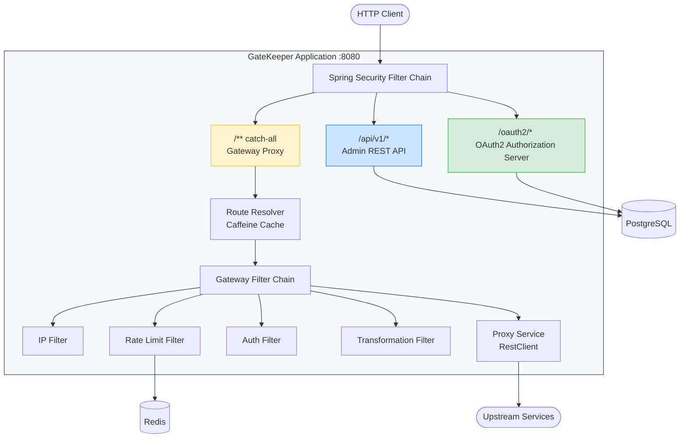

# GateKeeper

**Enterprise API Gateway & Identity Provider**

[](https://openjdk.org/)
[](https://spring.io/projects/spring-boot)
[](LICENSE)

GateKeeper is a centralized authentication, authorization, and API traffic management service for microservice architectures. It combines the functionality of an Identity Provider (like Keycloak) and an API Gateway (like Kong) into a single, cohesive product.

Instead of configuring and maintaining two separate systems, teams get a unified control plane for access management, routing, rate limiting, and traffic analytics.

---

## Architecture



---

## Tech Stack

| Layer | Technology |
|-------|-----------|
| Language | Java 21 |
| Framework | Spring Boot 3.3.2, Spring Security, Spring Authorization Server |
| Resilience | Resilience4j (Circuit Breaker) |
| Database | PostgreSQL 16 |
| Cache | Redis 7 (rate limiting), Caffeine (route/config cache) |
| Migrations | Liquibase |
| Mapping | MapStruct |
| API Docs | SpringDoc OpenAPI (Swagger UI) |
| Testing | JUnit 5, Testcontainers, WireMock, Mockito |
| Observability | Micrometer + Prometheus, Structured JSON logging (Logback) |
| Containerization | Docker, Docker Compose |

---

## Key Features

- **OAuth2 / OIDC Authorization Server** -- Authorization Code, Client Credentials, Refresh Token flows with JWKS and Discovery endpoints
- **RBAC with Role Hierarchy** -- SUPER_ADMIN > ADMIN > OPERATOR > VIEWER with granular permissions (`users:read`, `routes:write`)
- **Multi-Tenant Isolation** -- data segregation by tenant, API key identification, per-tenant RPS limits
- **Dynamic API Gateway** -- path-based routing from database, strip-prefix, method filtering, priority ordering
- **Rate Limiting** -- Token Bucket algorithm via Redis with `X-RateLimit-Remaining` and `Retry-After` headers
- **IP Filtering** -- whitelist/blacklist with CIDR notation support per tenant
- **Circuit Breaker** -- Resilience4j-powered fault tolerance for upstream services
- **Request/Response Transformation** -- header manipulation per route (add, remove, replace)
- **Traffic Analytics** -- RPS, latency percentiles (p50/p95/p99), status code breakdown
- **Audit Logging** -- append-only log of all administrative actions with JSONB change tracking
- **Session Management** -- view and revoke active user sessions
- **Prometheus Metrics** -- gateway throughput, latency histograms, rate limit rejections, IP blocks

---

## API Endpoints

| Group | Prefix | Endpoints | Auth |
|-------|--------|-----------|------|
| OAuth2 Protocol | `/oauth2/*` | `POST /token`, `POST /authorize`, `POST /revoke`, `POST /introspect` | OAuth2 standard |
| OIDC Discovery | `/.well-known/*` | OpenID Configuration, JWKS | Public |
| Users | `/api/v1/users` | CRUD + search, pagination | ADMIN+ |
| Roles | `/api/v1/roles` | CRUD with hierarchy | ADMIN+ |
| OAuth2 Clients | `/api/v1/clients` | Register, list, deactivate | ADMIN+ |
| Tenants | `/api/v1/tenants` | CRUD, API key management | SUPER_ADMIN |
| Routes | `/api/v1/routes` | Dynamic route configuration | ADMIN+ |
| Rate Limits | `/api/v1/rate-limits` | Per-tenant and per-route limits | ADMIN+ |
| IP Rules | `/api/v1/ip-rules` | Whitelist / blacklist rules | ADMIN+ |
| Sessions | `/api/v1/sessions` | View & revoke sessions | Bearer |
| Analytics | `/api/v1/analytics` | Traffic stats, per-route breakdown | ADMIN+ |
| Gateway Proxy | `/**` | Reverse proxy to upstream services | Per-route config |

> 20+ custom REST endpoints, 30+ tests

---

## Getting Started

### Prerequisites

- Docker & Docker Compose

### Run

```bash
git clone https://github.com/andrey-shevtsov/gatekeeper.git
cd gatekeeper
docker compose up -d
```

The application starts at **http://localhost:8080**. Services included:

| Service | Port | Purpose |
|---------|------|---------|
| GateKeeper | 8080 | Main application |
| PostgreSQL | 5432 | Primary database |
| Redis | 6379 | Rate limiting state |
| Echo Service | 9090 | Upstream mock for gateway demo |

### Quick Test

```bash
# 1. Obtain an access token (client credentials flow)
TOKEN=$(curl -s -X POST http://localhost:8080/oauth2/token \
  -d "grant_type=client_credentials&client_id=demo-client&client_secret=demo-secret" \
  | jq -r '.access_token')

# 2. List gateway routes
curl -H "Authorization: Bearer $TOKEN" http://localhost:8080/api/v1/routes

# 3. Proxy a request through gateway to echo-service
curl http://localhost:8080/echo/hello

# 4. Swagger UI
open http://localhost:8080/swagger-ui.html
```

---

## Project Structure

```
com.ashevtsov.gatekeeper/
├── config/              # Spring configuration (Security, Redis, Cache, OpenAPI)
├── security/            # JWT customizer, UserDetailsService, TenantContext
├── user/                # User management domain (entity, service, controller, DTOs)
├── role/                # Roles & permissions with hierarchy
├── client/              # OAuth2 client registration
├── tenant/              # Multi-tenant management
├── session/             # User session tracking
├── gateway/             # API Gateway core
│   ├── filter/          #   Custom filter chain (IP, RateLimit, Auth, Transform)
│   ├── ProxyController  #   Catch-all reverse proxy
│   ├── ProxyService     #   RestClient-based request forwarding
│   └── RouteResolver    #   Ant-style path matching with Caffeine cache
├── ratelimit/           # Rate limit rule management
├── ipfilter/            # IP whitelist/blacklist with CIDR
├── analytics/           # Traffic logs and statistics
├── audit/               # Append-only audit log
└── common/              # Shared DTOs, exception handling
```

> Domain-driven package structure -- each domain is self-contained with its entity, repository, service, controller, and DTOs.

---

## Testing

```bash
# Run all tests (requires Docker for Testcontainers)
./mvnw verify
```

| Category | Description | Tools |
|----------|-------------|-------|
| Unit | Services, filters, mappers | Mockito |
| Integration | API endpoints, repositories, security flows | Testcontainers (PostgreSQL + Redis) |
| Security | OAuth2 flows, RBAC enforcement, token validation | Spring Security Test |
| Gateway | Proxy forwarding, rate limiting, IP filtering | WireMock |

All integration tests extend `AbstractIntegrationTest` with shared Testcontainers (PostgreSQL + Redis) for consistent and fast test execution.

---

## Observability

**Health checks:**
```
GET /actuator/health         # Aggregate status
GET /actuator/health/db      # PostgreSQL
GET /actuator/health/redis   # Redis
```

**Prometheus metrics** at `/actuator/prometheus`:

| Metric | Type | Description |
|--------|------|-------------|
| `gk_proxy_requests_total` | Counter | Gateway requests (by route, method, status) |
| `gk_proxy_latency_seconds` | Histogram | Proxy latency distribution |
| `gk_rate_limit_rejected_total` | Counter | Requests rejected by rate limiter |
| `gk_ip_blocked_total` | Counter | Requests blocked by IP filter |
| `gk_auth_tokens_issued_total` | Counter | Tokens issued (by grant type) |

---

## License

This project is licensed under the MIT License. See [LICENSE](LICENSE) for details.

---

**Author:** [Andrey Shevtsov](https://github.com/andrey-shevtsov)

> Русская версия: [README.md](README.md)
